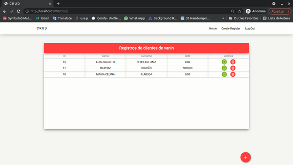
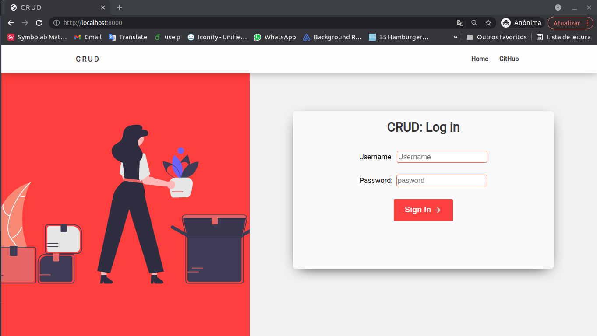

# Client Manage WebSite

This is a 4fun project that tries to create a real world website. Although this is a attemp of a website there is no production mode, because it is just a project to learn about Django framework, so there is motivation to up a clound server or something like that.

The website is a CRUD(Create, Read, update and Delete) that it propurse is manage a database of client, each user have its personal set of clients that can be deleted, updated and created. On this project there is a implementation of user autentication using Django framework dependencies, so the users would acess their client data in a secure way.

<p align="center">

</p>

## How run and test the project?

To run the project u need to create a virtual envirioment and install all dependencies on requirements.txt file, you can use the following set of commands to do it:

```bash
(venv)$ pip install -f requirements.txt
```

_OBS.:_ you can have some problems installing the psycopg2 and its binary. There some reasons why your problem is happenig and to solve it you have two methids: you can search on google the return error or u can remove both dependencies from the requirements.txt and use a sqlite database.

Now. the last thing that is required is to set a database. This part part can be a little tricky, but it isnt impossible u just have to follow the step by step:

1- Create a SQL database of your preferencie to use for this project. If you dont wanna put much work on that you can just use sqlite

2- Change the crud/settings.py file on the database section and put the information of your database. If you are using a sqlite db use the following configuration instead:

```python
DATABASES = {
    'default': {
        'ENGINE': 'django.db.backends.sqlite3',
        'NAME': os.path.join(BASE_DIR, '<dbname>.sqlite3'),
    }
}
```

3- Finally, it is required to migrate all the models to the database, so the follow comands are required:

```python
(venv)$ python3 manage.py makemigrations
(venv)$ python3 manage.py migrate
```

after that it is necesserie to create a superuser using the django cli.

The last piece is to create e super user on django admin

```bash
(venv)$ python3 manage.py createsuperuser
```

**If everything went as espected the project must be ready to go!!**

```bash
(venv)$ python3 manage.py runserver
```

**The application should be running at the 8000 localhost port!**

<p align="center">



</p>
